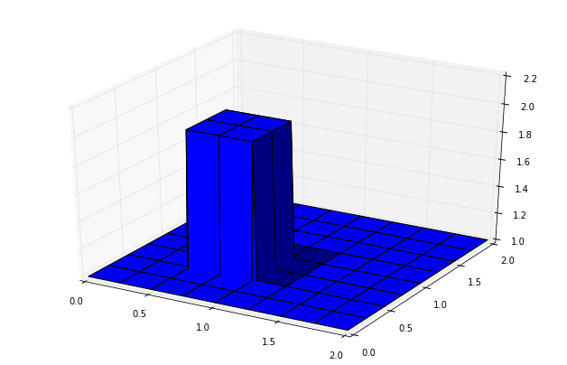
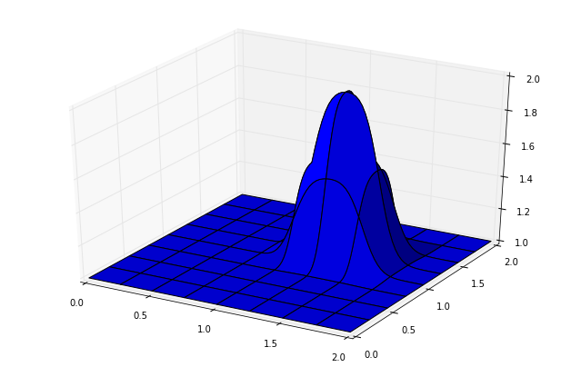
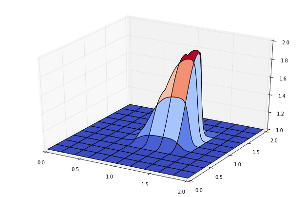
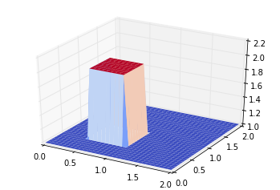
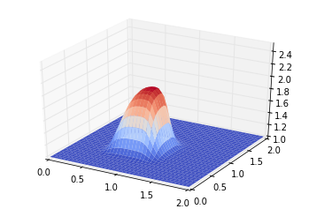
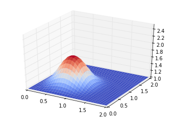
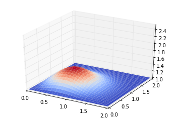
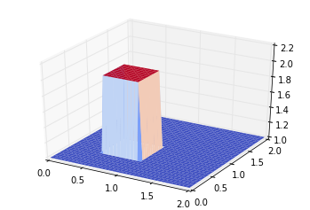

# Computational Fluid Dynamics in Python 2.7

Following the directions of the module called "12 steps to Navier-Stokes equations" at Boston University: 

http://lorenabarba.com/blog/cfd-python-12-steps-to-navier-stokes/

## 1-D Flows

### 1-D Linear Convection

The one-dimensional Linear Convection equation is:

$$\frac{\partial u}{\partial t} + c \frac{\partial u}{\partial x} = 0$$

which leads to the discrete equation:

$$\frac{u_i^{n+1}-u_i^n}{\Delta t} + c \frac{u_i^n - u_{i-1}^n}{\Delta x} = 0$$


```python
%matplotlib inline
import numpy as np                
import matplotlib.pyplot as plt 
import time, sys                

nx = 41  # try changing this number from 41 to 81 and Run All ... what happens?
dx = 2./(nx-1)
nt = 25    #nt is the number of timesteps we want to calculate
dt = .025  #dt is the amount of time each timestep covers (delta t)
c = 1.      #assume wavespeed of c = 1

u = np.ones(nx)      #numpy function ones()
u[int(.5/dx) : int(1/dx+1)]=2  #setting u = 2 between 0.5 and 1 as per our I.C.s
#print u

plt.plot(np.linspace(0,2,nx), u)
#plt.show()

un = np.ones(nx) #initialize a temporary array

for n in range(nt):  #loop for values of n from 0 to nt, so it will run nt times
	un = u.copy() ##copy the existing values of u into un
	for i in range(1,nx):
		u[i] = un[i]-c*dt/dx*(un[i]-un[i-1])  ## Linear Convection
		#u[i] = un[i]-un[i]*dt/dx*(un[i]-un[i-1])	## Non Linear Convection

plt.plot(np.linspace(0,2,nx),u)
plt.show()
```


### 1-D Diffusion

The one-dimensional diffusion equation is:

$$\frac{\partial u}{\partial t}= \nu \frac{\partial^2 u}{\partial x^2}$$

which leads to the discrete equation:

$$\frac{u_{i}^{n+1}-u_{i}^{n}}{\Delta t}=\nu\frac{u_{i+1}^{n}-2u_{i}^{n}+u_{i-1}^{n}}{\Delta x^2}$$


```python
nx = 41
dx = 2./(nx-1)
nt = 20    #the number of timesteps we want to calculate
nu = 0.3   #the value of viscosity
sigma = .2 #sigma is a parameter, we'll learn more about it later
dt = sigma*dx**2/nu #dt is defined using sigma ... more later!


u = np.ones(nx)      #a numpy array with nx elements all equal to 1.
u[int(.5/dx) : int(1/dx+1)]=2  #setting u = 2 between 0.5 and 1 as per our I.C.s

plt.plot(np.linspace(0,2,nx), u)

un = np.ones(nx) #our placeholder array, un, to advance the solution in time

for n in range(nt):  #iterate through time
    un = u.copy() ##copy the existing values of u into un
    for i in range(1,nx-1):
        u[i] = un[i] + nu*dt/dx**2*(un[i+1]-2*un[i]+un[i-1])
        
plt.plot(np.linspace(0,2,nx), u)
plt.show()
```


## 2-D Flows

### 2-D Linear Convection

The one-dimensional Linear Convection equation is:

$$\frac{\partial u}{\partial t}+c\frac{\partial u}{\partial x} + c\frac{\partial u}{\partial y} = 0$$

which leads to the discrete equation:

$$\frac{u_{i,j}^{n+1}-u_{i,j}^n}{\Delta t} + c\frac{u_{i, j}^n-u_{i-1,j}^n}{\Delta x} + c\frac{u_{i,j}^n-u_{i,j-1}^n}{\Delta y}=0$$


```python
from mpl_toolkits.mplot3d import Axes3D    # required for projected 3d plots

###variable declarations
nx = 81
ny = 81
nt = 100
c = 1
dx = 2.0/(nx-1)
dy = 2.0/(ny-1)
sigma = .2
dt = sigma*dx

x = np.linspace(0,2,nx)
y = np.linspace(0,2,ny)

u = np.ones((ny,nx)) ##create a 1xn vector of 1's
un = np.ones((ny,nx)) ##

###Assign initial conditions

u[int(.5/dy) : int(1/dy+1), int(.5/dx) : int(1/dx+1)] = 2 ##set hat function I.C. : u(.5<=x<=1 && .5<=y<=1 ) is 2

###Plot Initial Condition
fig = plt.figure(figsize=(11,7), dpi=100)          ##the figsize parameter can be used to produce different sized images
ax = fig.gca(projection='3d')                      
X, Y = np.meshgrid(x,y)                            
surf = ax.plot_surface(X,Y,u[:])

plt.show()

for n in range(nt+1): ##loop across number of time steps
#    un = u.copy()
#    for i in range(1, len(u)):
#        for j in range(1, len(u)):
#            u[i,j] = un[i, j] - (c*dt/dx*(un[i,j] - un[i-1,j]))-(c*dt/dy*(un[i,j]-un[i,j-1]))
#            u[0,:] = 1
#            u[-1,:] = 1
#            u[:,0] = 1
#            u[:,-1] = 1
## is equivalent to:
    un[:] = u[:]
    u[1:,1:]=un[1:,1:]-(c*dt/dx*(un[1:,1:]-un[0:-1,1:]))-(c*dt/dy*(un[1:,1:]-un[1:,0:-1]))
    u[0,:] = 1
    u[-1,:] = 1
    u[:,0] = 1
    u[:,-1] = 1			
			
fig = plt.figure(figsize=(11,7), dpi=100)
ax = fig.gca(projection='3d')
surf2 = ax.plot_surface(X,Y,u[:])

plt.show()
```








### 2-D Non Linear Convection

2D Convection is represented by the pair of coupled partial differential equations below:

$$\frac{\partial u}{\partial t} + u \frac{\partial u}{\partial x} + v \frac{\partial u}{\partial y} = 0$$
$$\frac{\partial v}{\partial t} + u \frac{\partial v}{\partial x} + v \frac{\partial v}{\partial y} = 0$$

Discretizing these equations using the methods we've applied previously yields:

$$\frac{u_{i,j}^{n+1}-u_{i,j}^n}{\Delta t} + u_{i,j}^n \frac{u_{i,j}^n-u_{i-1,j}^n}{\Delta x} + v_{i,j}^n \frac{u_{i,j}^n-u_{i,j-1}^n}{\Delta y} = 0$$
$$\frac{v_{i,j}^{n+1}-v_{i,j}^n}{\Delta t} + u_{i,j}^n \frac{v_{i,j}^n-v_{i-1,j}^n}{\Delta x} + v_{i,j}^n \frac{v_{i,j}^n-v_{i,j-1}^n}{\Delta y} = 0$$


```python
from mpl_toolkits.mplot3d import Axes3D   # required for projected 3d plots

###variable declarations
nx = 101
ny = 101
nt = 80
c = 1
dx = 2.0/(nx-1)
dy = 2.0/(ny-1)
sigma = .2
dt = sigma*dx

x = np.linspace(0,2,nx)
y = np.linspace(0,2,ny)

u = np.ones((ny,nx)) ##create a 1xn vector of 1's
v = np.ones((ny,nx))
un = np.ones((ny,nx))
vn = np.ones((ny,nx))

###Assign initial conditions

u[int(.5/dy) : int(1/dy+1), int(.5/dx) : int(1/dx+1)]=2 ##set hat function I.C. : u(.5<=x<=1 && .5<=y<=1 ) is 2
v[int(.5/dy) : int(1/dy+1), int(.5/dx) : int(1/dx+1)]=2 ##set hat function I.C. : u(.5<=x<=1 && .5<=y<=1 ) is 2

for n in range(nt+1): ##loop across number of time steps
    un = u.copy()
    vn = v.copy()

    u[1:,1:]=un[1:,1:]-(un[1:,1:]*dt/dx*(un[1:,1:]-un[0:-1,1:]))-vn[1:,1:]*dt/dy*(un[1:,1:]-un[1:,0:-1]) 
    v[1:,1:]=vn[1:,1:]-(un[1:,1:]*dt/dx*(vn[1:,1:]-vn[0:-1,1:]))-vn[1:,1:]*dt/dy*(vn[1:,1:]-vn[1:,0:-1])
    
    u[0,:] = 1
    u[-1,:] = 1
    u[:,0] = 1
    u[:,-1] = 1
    
    v[0,:] = 1
    v[-1,:] = 1
    v[:,0] = 1
    v[:,-1] = 1
	
from matplotlib import cm ##cm = "colormap" for changing the 3d plot color palette
fig = plt.figure(figsize=(11,7), dpi=100)
ax = fig.gca(projection='3d')
X,Y = np.meshgrid(x,y)
ax.plot_surface(X,Y,u, cmap=cm.coolwarm)

plt.show()

from matplotlib import cm ##cm = "colormap" for changing the 3d plot color palette
fig = plt.figure(figsize=(11,7), dpi=100)
ax = fig.gca(projection='3d')
X,Y = np.meshgrid(x,y)
ax.plot_surface(X,Y,v, cmap=cm.coolwarm)

plt.show()
```





### 2-D Diffusion

The 2D-diffusion equation is:

$$\frac{\partial u}{\partial t} = \nu \frac{\partial ^2 u}{\partial x^2} + \nu \frac{\partial ^2 u}{\partial y^2}$$

which leads to the discrete equation:

$$\frac{u_{i,j}^{n+1} - u_{i,j}^n}{\Delta t} = \nu \frac{u_{i+1,j}^n - 2 u_{i,j}^n + u_{i-1,j}^n}{\Delta x^2} + \nu \frac{u_{i,j+1}^n-2 u_{i,j}^n + u_{i,j-1}^n}{\Delta y^2}$$


```python
from mpl_toolkits.mplot3d import Axes3D ##library for 3d projection plots
from matplotlib import cm ##cm = "colormap" for changing the 3d plot color palette

###variable declarations
nx = 31
ny = 31
nt = 17
nu=.05
dx = 2.0/(nx-1)
dy = 2.0/(ny-1)
sigma = .25
dt = sigma*dx*dy/nu

x = np.linspace(0,2,nx)
y = np.linspace(0,2,ny)

u = np.ones((ny,nx)) ##create a 1xn vector of 1's
un = np.ones((ny,nx)) ##

###Assign initial conditions
u[int(.5/dy) : int(1/dy+1), int(.5/dx) : int(1/dx+1)] = 2 ##set hat function I.C. : u(.5<=x<=1 && .5<=y<=1 ) is 2
## and display IC
fig = plt.figure()
ax = fig.gca(projection='3d')
X,Y = np.meshgrid(x,y)
surf = ax.plot_surface(X,Y,u[:], rstride=1, cstride=1, cmap=cm.coolwarm, linewidth=0, antialiased=True)
plt.show()
ax.set_xlim(1,2)
ax.set_ylim(1,2)
ax.set_zlim(1,2.5)
#ax.zaxis.set_major_locator(LinearLocator(5))	
	
def plot2D(x, y, u):    ## non used here
    fig = plt.figure(figsize=(11,7), dpi=100)
    ax = fig.gca(projection='3d')
    X,Y = np.meshgrid(x,y)
    surf = ax.plot_surface( X,Y,u[:], rstride=1, cstride=1, cmap=cm.coolwarm, linewidth=0, antialiased=True)
    ax.set_xlim(0,2)
    ax.set_ylim(0,1)
    ax.view_init(30,225)	
	
	
def diffuse(nt):      ###Run through nt timesteps
    u[int(.5/dy) : int(1/dy+1), int(.5/dx) : int(1/dx+1)] = 2
    
    for n in range(nt+1): 
        un = u.copy()
        u[1:-1,1:-1]=un[1:-1,1:-1]+nu*dt/dx**2*(un[2:,1:-1]-2*un[1:-1,1:-1]+un[0:-2,1:-1])+nu*dt/dy**2*(un[1:-1,2:]-2*un[1:-1,1:-1]+un[1:-1,0:-2])
        u[0,:]=1
        u[-1,:]=1
        u[:,0]=1
        u[:,-1]=1
		
	## and display u
    fig = plt.figure()
    ax = fig.gca(projection='3d')
    surf = ax.plot_surface(X,Y,u[:], rstride=1, cstride=1, cmap=cm.coolwarm, linewidth=0, antialiased=True)
    ax.set_zlim(1,2.5)
    plt.show()
	
diffuse(5)
diffuse(15)
diffuse(50)
```














### 2-D Non Linear Convection with Diffusion


```python
from mpl_toolkits.mplot3d import Axes3D
from matplotlib import cm


###variable declarations
nx = 41
ny = 41
nt = 120
c = 1
dx = 2.0/(nx-1)
dy = 2.0/(ny-1)
sigma = .0009
nu = 0.01
dt = sigma*dx*dy/nu


x = np.linspace(0,2,nx)
y = np.linspace(0,2,ny)

u = np.ones((ny,nx)) ##create a 1xn vector of 1's
v = np.ones((ny,nx))
un = np.ones((ny,nx)) ##
vn = np.ones((ny,nx))
comb = np.ones((ny,nx))

###Assign initial conditions

u[int(.5/dy) : int(1/dy+1), int(.5/dx) : int(1/dx+1)] = 2 ##set hat function I.C. : u(.5<=x<=1 && .5<=y<=1 ) is 2
v[int(.5/dy) : int(1/dy+1), int(.5/dx) : int(1/dx+1)] = 2 ##set hat function I.C. : u(.5<=x<=1 && .5<=y<=1 ) is 2

###(plot ICs)
#fig = plt.figure(figsize=(11,7), dpi=100)
#ax = fig.gca(projection='3d')
#X,Y = np.meshgrid(x,y)
#wire1 = ax.plot_wireframe(X,Y,u[:], cmap=cm.coolwarm)
#wire2 = ax.plot_wireframe(X,Y,v[:], cmap=cm.coolwarm)
#ax.set_xlim(1,2)
#ax.set_ylim(1,2)
#ax.set_zlim(1,5)
#plt.show()

fig = plt.figure()
ax = fig.gca(projection='3d')
X,Y = np.meshgrid(x,y)
surf = ax.plot_surface(X,Y,u[:], rstride=1, cstride=1, cmap=cm.coolwarm, linewidth=0, antialiased=True)
plt.show()
ax.set_xlim(1,2)
ax.set_ylim(1,2)
ax.set_zlim(1,5)

def burgers(nt):      ###Run through nt timesteps
	for n in range(nt+1): ##loop across number of time steps
		un = u.copy()
		vn = v.copy()

		u[1:-1,1:-1] = un[1:-1,1:-1] - dt/dx*un[1:-1,1:-1]*(un[1:-1,1:-1]-un[0:-2,1:-1])-dt/dy*vn[1:-1,1:-1]* \
                   (un[1:-1,1:-1]-un[1:-1,0:-2])+nu*dt/dx**2*(un[2:,1:-1]-2*un[1:-1,1:-1]+un[0:-2,1:-1])+ \
                   nu*dt/dy**2*(un[1:-1,2:]-2*un[1:-1,1:-1]+un[1:-1,0:-2])
    
		v[1:-1,1:-1] = vn[1:-1,1:-1] - dt/dx*un[1:-1,1:-1]*(vn[1:-1,1:-1]-vn[0:-2,1:-1])-dt/dy*vn[1:-1,1:-1]* \
                   (vn[1:-1,1:-1]-vn[1:-1,0:-2])+nu*dt/dx**2*(vn[2:,1:-1]-2*vn[1:-1,1:-1]+vn[0:-2,1:-1])+ \
                   nu*dt/dy**2*(vn[1:-1,2:]-2*vn[1:-1,1:-1]+vn[1:-1,0:-2])
     
		u[0,:] = 1
		u[-1,:] = 1
		u[:,0] = 1
		u[:,-1] = 1
    
		v[0,:] = 1
		v[-1,:] = 1
		v[:,0] = 1
		v[:,-1] = 1

burgers(400)
		
#fig = plt.figure(figsize=(11,7), dpi=100)
#ax = fig.gca(projection='3d')
#X,Y = np.meshgrid(x,y)
#wire1 = ax.plot_wireframe(X,Y,u[:])
#wire2 = ax.plot_wireframe(X,Y,v[:])
#ax.set_xlim(1,2)
#ax.set_ylim(1,2)
#ax.set_zlim(1,5)
#plt.show()

fig = plt.figure()
ax = fig.gca(projection='3d')
surf = ax.plot_surface(X,Y,u[:], rstride=1, cstride=1, cmap=cm.coolwarm, linewidth=0, antialiased=True)
ax.set_zlim(1,2.5)
plt.show()
```





```python

```
